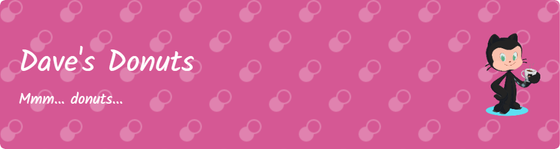

# Dave's Donuts

Daily Happiness is a mock landing page for an imaginary donut site. This was the first real solo project I did, so it's rather special to me.

View the hosted site here: [Daily Happiness](https://davesdonuts.netlify.app/)

## Usage

This was mostly me just practicing relevant CSS styling and animations. Have fun clicking around and looking at what I was able to do.

## Contributing

Pull requests are welcome. For major changes, please open an issue first
to discuss what you would like to change.

Please make sure to update tests as appropriate.
